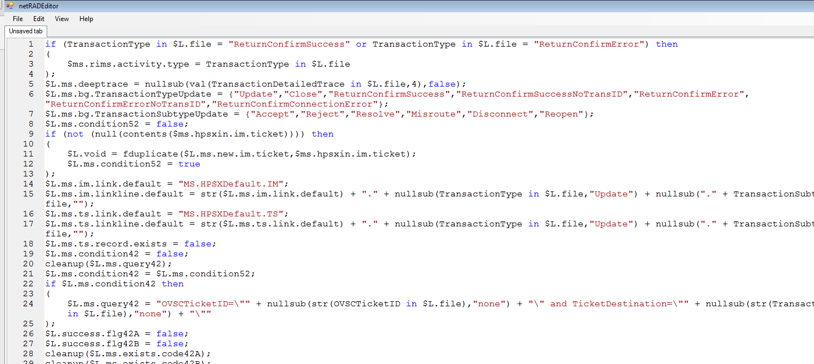

#Stand Alone RAD Editor#
---
This is a stand alone RAD (Rapid Application Developement) editor, which provide the similar functions as [RAD Editor](https://github.com/daizhen/HP_ServiceManager_RAD_Editor "RAD Editor") but without start Service Manager client.

Download [Runnable.zip](res/Runnable.zip "Runnable.zip") and run **netRADEditor.exe**

Screen shot:

